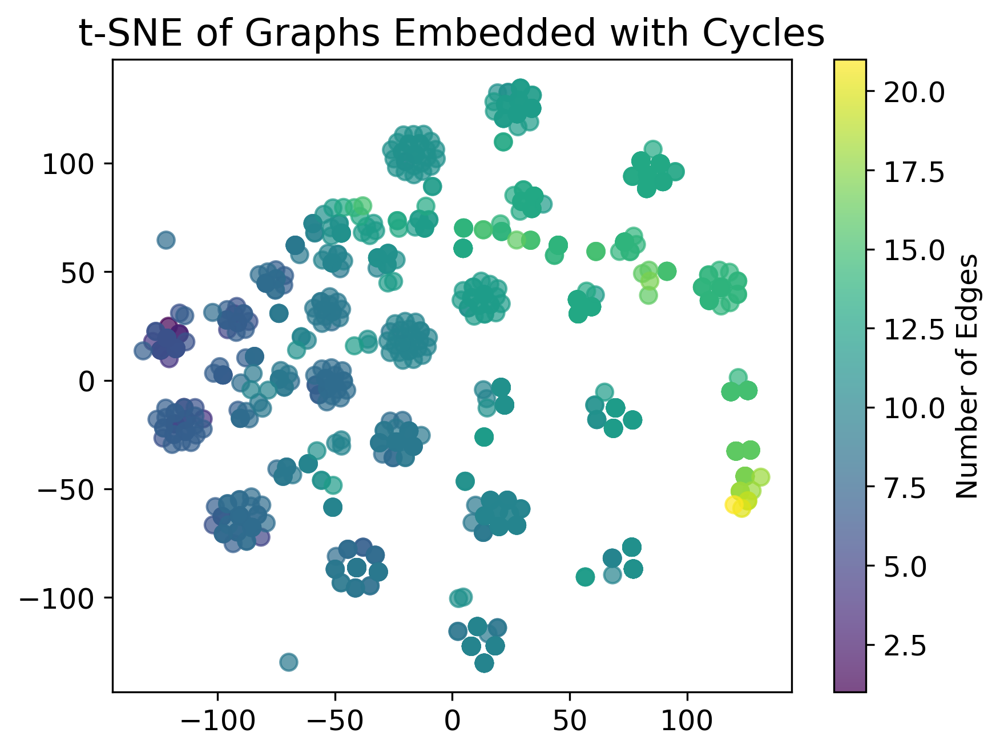
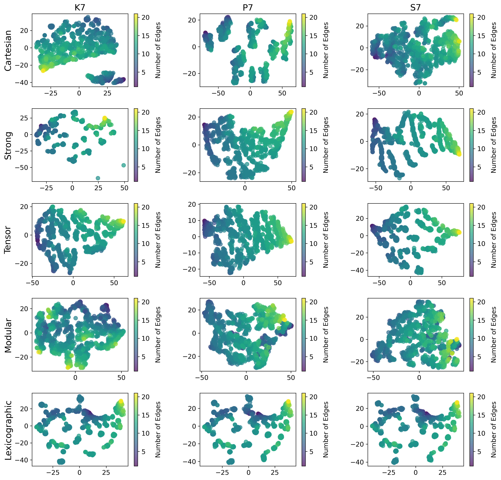

# graph-gumbo
Welcome to graph-gumbo! This project is an exploration into the world of graph theory, focusing on the interplay between different graph products and graph embeddings.

## Project Overview
Key Components

1. **Graph Products**: We explored three types of graph products - Cartesian, Strong, and Tensor - applying them to combinations of graphs from our dataset with factor graphs.

2. **Factor Graphs**: We explored three types of factor graphs - complete graphs ($K_n$), path graphs ($P_n$), and star graphs ($S_n$) - applying them to graphs from our dataset with graph products.

3. **Graph Embedding**: The core methodology involved embedding graphs based on cycle counting, capturing the cyclic structures within graphs.

4. **Baseline Comparison**: Two baselines were established - one using the cycle counting method for original graphs and another using the Weisfeiler-Lehman isomorphism test.

## Results

### Absolute Performance

| Factor    | Cartesian | Strong | Tensor |
| ------    | --------- | ------ | ------ |
| $K_3$     | 1096      | 11795  | 255    |
| $K_5$     | 1040      | 9086   | 108    |
| $K_7$     | 1039      | 9086   | 96     |
| $K_{13}$  | 1039      | 9086   | **95** |
| $P_3$     | 1407      | 787    | 7311   |
| $P_5$     | 1404      | 33     | 549    |
| $P_7$     | 1404      | 11     | 121    |
| $P_{13}$  | 1404      | **5**  | 49     |
| $S_3$     | 191       | 1987   | 7263   |
| $S_5$     | **185**   | 2570   | 7224   |
| $S_7$     | 185       | 1390   | 7224   |
| $S_{13}$  | 185       | 1443   | 7224   |


This table showcases the performance of different graph products with various factor graphs. It indicates the number of non-discernible pairs of graphs per method, highlighting the effectiveness of specific combinations.

### t-SNE Dimensionality Reduction



This plot shows the original graphs (without any graph product) embedded in a 2D space using t-SNE dimensionality reduction. The colors indicate the different number of edges.



These plots provide a visual representation of the embeddings of the and transformed graphs using t-SNE dimensionality reduction. They illustrate the dispersion and uniformity in the embedding space.

### Conclusion
The study demonstrates the effectiveness of combining graph products with cycle counting in graph embeddings. Specific combinations, notably the Strong product with path graphs, significantly reduce collisions, enhancing the distinctiveness of graph embeddings, even suprassing the expressiveness of the Weisfeiler-Lehman test. This work suggests new avenues for research and optimization in the field of graph embeddings.

## Getting Started
To get started, clone this repository and install the required dependencies. The project is written using Python 3.11.5, and the dependencies can be installed using the following command:

**Pip**
```
pip install -r requirements.txt
```

**Conda**
```
conda create --name graph-gumbo --file requirements.txt
```
## Gumbo
The name **gumbo** pays homage to the [Gumbo](https://en.wikipedia.org/wiki/Gumbo) dish, which is a stew that combines a variety of ingredients to create a delicious meal. Similarly, this project combines a variety of graph products with factor graphs to create a powerful graph embedding.


