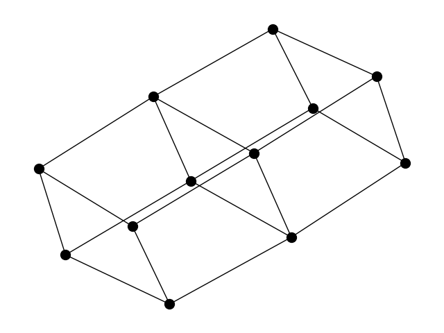
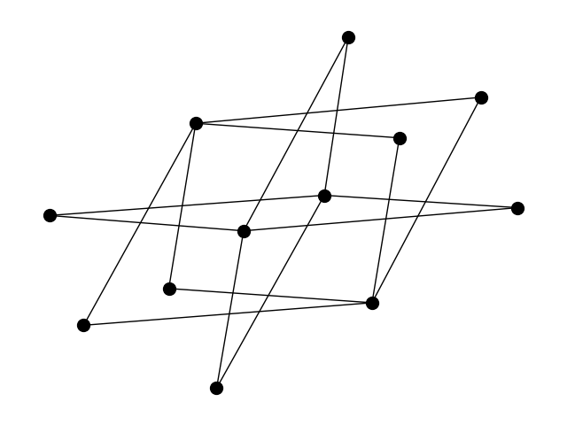

# graph-gumbo
Welcome to graph-gumbo! This project is an exploration into the world of graph theory, focusing on the interplay between different graph products and graph embeddings.

## Project Overview
We approach the problem of embedding a graph in the following manner:

1. **Fixed Factor Graph Products**: We enhance the 	sturctural features of the graph, by applying a graph product with a predetermined factor graph. This step needs to be performed equally on all graphs, to ensure that the embeddings are comparable. We consider the following graph products:
	- Cartesian Product

	
	
	- Direct Product

	

	- Strong Product

	
	
	- Modular Product

	

	And we analyze the effects of the following factor graphs:

	- $K_n$: Complete Graph
	- $P_n$: Path Graph
	- $S_n$: Star Graph


2. **Graph Embeddings**: We then embed the transformed graphs into a vector space by counting the number of occurences of subgstructures with certain sizes. We specifically consider cycles, since they encode rich features about the graph, in the product space. More specifically, we look at the number of
	- Chordless Cycles, and
	- Basis Cycles (of a fundamental cycle basis)

	of each length and use their count as features for the embedding.

### t-SNE Dimensionality Reduction

When looking at the embeddings, that we obtain before and after applying the graph products, we can use t-SNE dimensionality reduction to visualize the embeddings in a 2D space. This allows us to see how the embeddings are distributed and how they compare to each other. Especially interesting is the dispersion that occurs after applying the graph products, which helps distinguish different graphs from each other.


This plot shows the original graphs (without any graph product) embedded in a 2D space using t-SNE dimensionality reduction. The colors indicate the different number of edges.


These plots provide a visual representation of the embeddings of the and transformed graphs using t-SNE dimensionality reduction. They illustrate the dispersion and uniformity in the embedding space.


## Getting Started
To get started, clone this repository and install the required dependencies. The project is written using Python 3.11, and the dependencies can be installed using the following command:

**Conda**
```
conda create --name graph-gumbo --file environment.yml
```

## Gumbo
The name **gumbo** pays homage to the [Gumbo](https://en.wikipedia.org/wiki/Gumbo) dish, which is a stew that combines a variety of ingredients to create a delicious meal. Similarly, this project combines a variety of graph products with factor graphs to create a powerful graph embedding.


